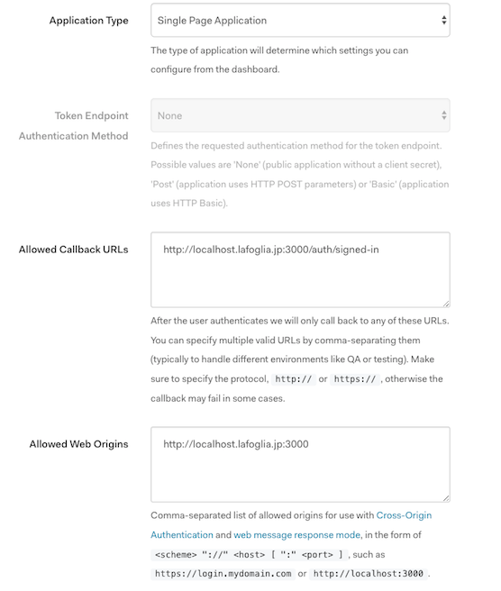
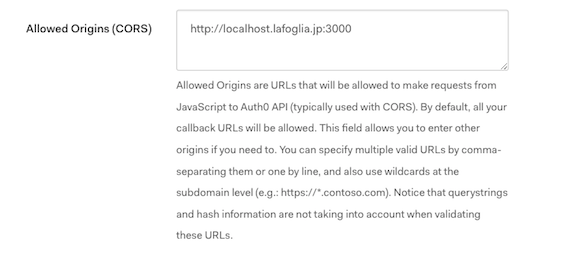
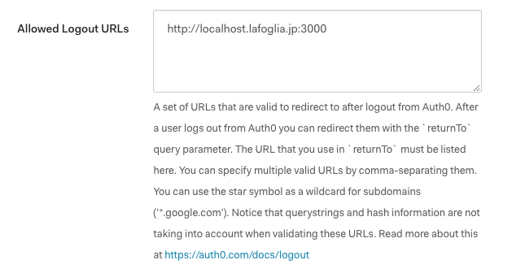

**playground** branch

# nuxt-auth0

> A simple example that shows how to use [Nuxt.js](https://nuxtjs.org) with [Auth0](https://auth0.com)


You can access a simple demo here: https://auth0.nuxtjs.org

## Credits

This example is inspired by [next.js-auth0](https://github.com/luisrudge/next.js-auth0) made by [Luís Rudge](https://github.com/luisrudge).

## Setup

* Create an account at Auth0 (https://auth0.com)
* Add your endpoints to your client's allowed urls like this 


    
    
    
    
* Add your logout endpoint to your account allowed urls like this 

* Copy the file `config.sample.json` at the root folder, rename it as `config.json` and add your Auth0 keys

## Running Locally

/etc/hosts:

```
127.0.0.1  localhost localhost.lafoglia.jp
```

```
git clone https://github.com/hdknr/example-auth0.git
cd example-auth0
npm install
npm run dev
```
